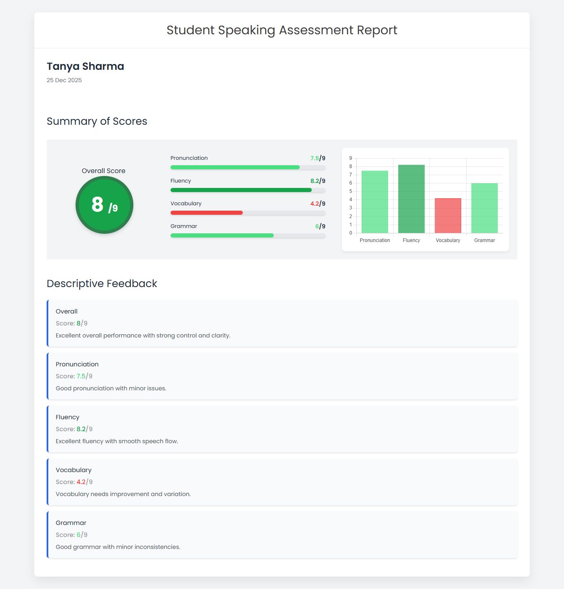

# Student Speaking Assessment Report Page

This project is a **Student Speaking Assessment Report Page** developed as part of a
**Full Stack Development assignment**.

The page displays a student’s speaking assessment result similar to platforms like
SpeechAce / IELTS score reports.  
Only the **Summary of Scores** and **Descriptive Feedback** sections are implemented,
as required in the assignment.

---

##  Assignment Objective

The goal of this assignment is to demonstrate:

- Frontend UI skills
- Basic data handling using JSON
- Logical thinking through score-based feedback
- Clean and readable code structure

This is a **functional prototype**, not a production-ready system.

---

##  Project Structure

```

STUDENT-ASSESSMENT-REPORT/
│
├── index.html   → Report page structure (UI)
├── style.css    → Styling, layout, and responsiveness
├── script.js    → Data loading, score logic, feedback logic, chart logic
├── data.json    → Student assessment scores

````

---

##  How to Run the Project

1. Download or clone the repository.
2. Open the project folder.
3. Open `index.html` in any modern web browser (Chrome, Edge, Firefox).

No backend server, database, or installation steps are required.

---

##  Where the Scores Are Stored

All student scores are stored in a simple JSON file:

**`data.json`**

Example:
```json
{
  "studentName": "Tanya Sharma",
  "testDate": "25 Dec 2025",
  "overallScore": 8,
  "skills": {
    "pronunciation": 7.5,
    "fluency": 8.2,
    "vocabulary": 4.2,
    "grammar": 6
  }
}
````

### Data Handling Logic

* The file is loaded using the `fetch()` API inside `script.js`
* Function used: `loadData()`
* If `data.json` fails to load, a fallback in-memory object is used

This fulfills the **JSON-based data source requirement** of the assignment.

---

##  Feedback Logic (Important)

Descriptive feedback is generated automatically based on score ranges.

### Score Conditions Used

* **Score ≥ 8** → Excellent performance
* **Score between 5 and 7.9** → Good performance with minor improvements
* **Score < 5** → Needs improvement

### Implementation

* Feedback logic is implemented inside the function:

  ```js
  generateFeedback(skill, score)
  ```
* Feedback is generated for:

  * Overall score
  * Pronunciation
  * Fluency
  * Vocabulary
  * Grammar
* Feedback updates automatically whenever score values change in `data.json`

This satisfies the **dynamic feedback requirement** of the assignment.

---


### Color Logic Implementation

The project uses dynamic color coding to visually represent performance levels based on scores.

Color Rules:

Score < 5 → Red (Low performance)
Score 5 – 7.9 → Light Green (Good performance)
Score ≥ 8 → Dark Green (High performance)

Implementation:

Color logic is handled using the function:

getColorByScore(score)

This function returns:
Solid color for text, progress bars, and overall score circle
RGBA color for Chart.js bars
Colors are applied consistently across:
Skill progress bars
Skill score text
Bar chart bars

Overall score circular badge (via --overall-color)

##  Graphical Representation

The project includes graphical score representation as required:

* Skill-wise progress bars
* Bar chart using **Chart.js**

### Chart Details

* Displays Pronunciation, Fluency, Vocabulary, and Grammar scores
* Score range: 0 to 9
* Chart is initialized using the `initChart()` function in `script.js`

---

##  Tech Stack Used

* HTML
* CSS
* JavaScript (Vanilla)
* Chart.js

No backend framework or database is used, as per assignment instructions.

---

##  Screenshots

### Dashboard
